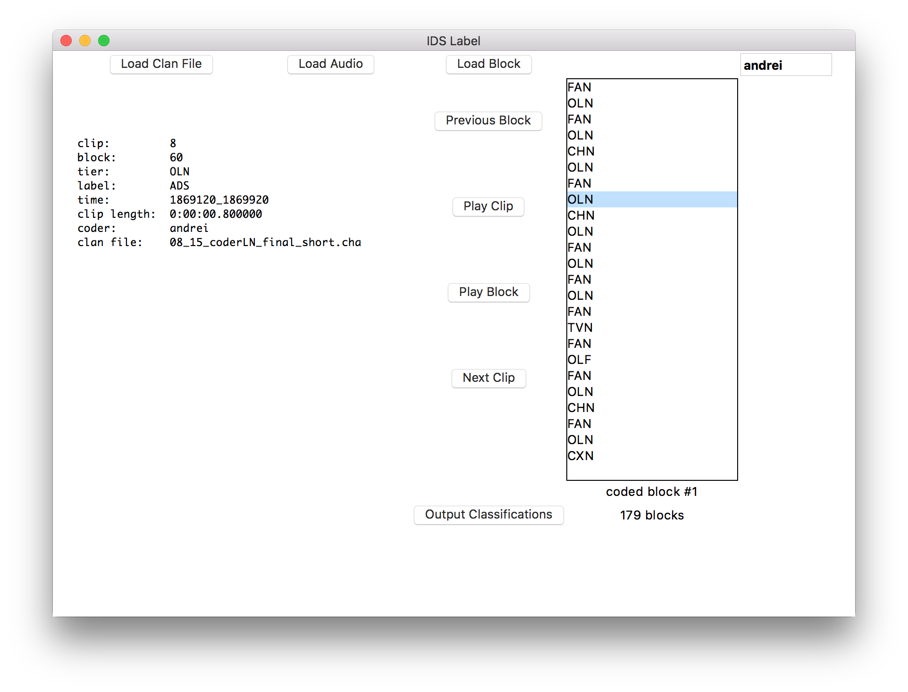

# idslabel

Note: This is nowhere near ready yet.




## requirements

This application depends on FFmpeg, PortAudio and PyAudio.

#### ffmpeg
To install the ffmpeg binary, download from [here](https://www.ffmpeg.org/download.html). OS specific binaries are under the "Get the packages" section. The binary should be put somewhere on your $PATH, like /usr/local/bin (on Linux/OS X).

#### portaudio
To install PortAudio, the easiest way is to use your operating system's package manager.

For OS X, you can use [homebrew](http://brew.sh/):
```bash
$: brew install portaudio
```

For Debian/Ubuntu Linux:
```bash
$: sudo apt-get install portaudio
```

#### pyaudio

The easiest way to install is with pip:
```bash
$: sudo pip install pyaudio
```

## usage

You need to "Load Audio" before "Load Clan". Then, "Load Block", select the clips in the box, and either click "Play Clip" or use the shortcut
(spacebar). After selecting one of the classifications (shortcuts listed below), move on to the next clip with the arrow keys.


There are keyboard shortcuts for selecting the classification and cycling through the clips:

- General Keys
 - shift + a : load audio file
 - shift + c : load clan file
 - shift + enter : load random block
 - shift + \ : load previous block

- Classification Keys
 - i : IDS
 - a : ADS
 - n : Neither
 - j : Junk

- Clip Keys
 - up : previous clip
 - down: next clip
 - left          : previous clip
 - right         : next clip
 - space         : play clip
 - shift + space : play block


Tiers which are composed of multiple lines, e.g. :
```
*CHN:	0 2662230_2662370  
  &=vocalization 2662370_2663380   
  0 . 2663380_2663480
```
have a symbol associated with them to signify they're part of the unit ( " ^- " , it's supposed to be an arrow pointinng to the parent tier)

In the classification output, if clips are associated together as part of a multi-line tier, the value in the "multi-tier"
column will be the timestamp of the parent line that they're associated to. In the example provided above, the line with
the timestamp of 2662230_2662370 will be the parent to the following 2 lines.


## status

### implemented

- parsing cha file and extracting Conversation blocks
- chopping up associated audio file
 - each conversation block is chopped as a unit (upon loading)
 - each tier (except comments and *SIL) within a block is chopped into a new audio clip given its timestamp in the cha file
- randomize the blocks and allow the user to load a random one for classification
- list the clips within the currently loaded block, and allow the user to play the audio for a given clip.
- allow the user to select a classification for the currently playing clip
 - ids
 - ads
 - neither
 - junk
- export classifications to csv

### not implemented yet

- connect to server and checkout cha/audio file for labeling
- turn app into standalone executable with py2app and py2exe
- lots of UI things (make it more convenient)
